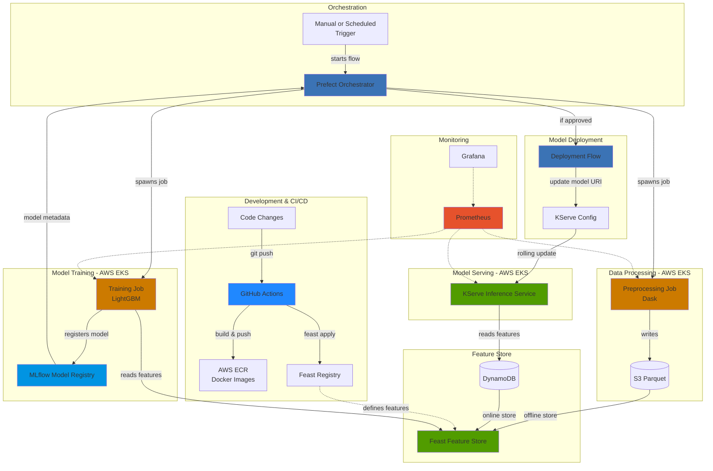

# Player Churn MLOps Pipeline

[](https://github.com/hzabun/player-churn-mlops/actions/workflows/ci.yml)

Production-grade MLOps pipeline for player churn prediction using event-driven behavioral data. Demonstrates end-to-end ML infrastructure with distributed preprocessing (Dask), feature store architecture (Feast), MLflow model registry, and cloud-native deployment (AWS EKS).

> [!Note]
> Active development - core infrastructure (Terraform, EKS, Feast, MLflow, Prefect orchestration) is production-ready. Model serving and monitoring layers in progress.

## System Architecture


## Technical Highlights

**Production ML Infrastructure:**
- AWS EKS cluster provisioned via Terraform for scalable compute
- Containerized preprocessing and training pipelines (Docker + ECR)
- MLflow model registry for versioned model tracking and lifecycle management
- Feast feature store with S3 offline store (soon replaced with Redshift) and DynamoDB online store for low-latency serving
- Prefect orchestration for workflow scheduling and monitoring

**Distributed Data Processing:**
- Event-driven behavioral data (player actions, sessions, items)
- Dask clusters for distributed preprocessing of large game log datasets
- Session aggregation pipeline generating player-level behavioral features

**MLOps Best Practices:**
- Infrastructure as Code (Terraform) for reproducible cloud environments
- Centralized model registry (MLflow) with experiment tracking and versioning
- Automated model promotion workflow (staging → production)
- CI/CD pipeline (GitHub Actions) with automated linting and testing
- Modern Python dependency management with uv
- Model deployment on Kubernetes with KServe (in progress)
- Observability layer with Prometheus and Grafana (in progress)

## At a Glance

| Component           | Technology                              | Status        |
|---------------------|-----------------------------------------|---------------|
| Infrastructure      | Terraform + AWS EKS                     | ✅ Production |
| Data Processing     | Dask (distributed)                      | ✅ Production |
| Feature Store       | Feast (S3 + DynamoDB)                   | ✅ Production |
| Model Training      | LightGBM                                | ✅ Production |
| Model Registry      | MLflow (deployed on EKS)                | ✅ Production |
| Orchestration       | Prefect                                 | ✅ Production |
| Containerization    | Docker + AWS ECR                        | ✅ Production |
| CI/CD               | GitHub Actions                          | ✅ Production |
| Model Serving       | KServe on EKS                           | 🚧 In Progress |
| Monitoring          | Prometheus + Grafana                    | 🚧 In Progress |
| Drift Detection     | EvidentlyAI                             | 📋 Planned    |

## Pipeline Overview
```
Player Events → Dask Preprocessing → Feast Feature Store → LightGBM Training → MLflow Registry → KServe Deployment → Monitoring
```

**Data Flow:**
1. Raw player event logs (actions, sessions, items) ingested from game servers
2. Distributed preprocessing via Dask clusters aggregates events into session-level features
3. Processed features written to Feast offline store (S3 parquet files, later replaced with AWS Redshift)
4. Model training fetches feature sets from Feast for LightGBM training
5. Trained models registered in MLflow with experiment tracking and versioning
6. Deployment flow validates model performance and promotes to production stage
7. KServe inference service updated to serve latest production model from MLflow
8. Online features served from DynamoDB for low-latency predictions
9. Monitoring dashboards track model performance and infrastructure health

## Key Features

**Model Lifecycle Management:**
- MLflow experiment tracking with hyperparameter logging
- Model versioning with automatic metadata capture
- Stage-based promotion (None → Staging → Production → Archived)
- Model lineage tracking (data version, feature version, code version)

**Feature Engineering:**
- Session-based behavioral aggregations (actions per session, item transactions, experience gained)
- Temporal features (play frequency, session duration patterns)
- Engagement metrics (progression rate, social interactions)

**Scalability:**
- Kubernetes-based deployment for horizontal scaling
- Distributed preprocessing handles large game log datasets
- Feature store architecture separates offline training from online serving
- Model registry enables A/B testing and canary deployments

**Observability:**
- Prefect UI for pipeline monitoring and debugging
- MLflow UI for experiment tracking and model comparison
- Prometheus metrics collection for infrastructure and model performance
- Grafana dashboards for visualization (in progress)
- EvidentlyAI for data/concept drift detection (planned)

## Quick Start

**Prerequisites:**
- AWS account with EKS access
- Terraform ≥1.0
- Docker
- Python 3.10+
- [uv](https://github.com/astral-sh/uv) (modern Python package manager)

**Setup:**
```bash
# Clone repository
git clone https://github.com/my-account/player-churn-mlops
cd player-churn-mlops

# Install uv (if not already installed)
curl -LsSf https://astral.sh/uv/install.sh | sh

# Install dependencies with uv
uv sync

# Activate virtual environment
source .venv/bin/activate  # Linux/macOS
# or
.venv\Scripts\activate     # Windows

# Provision infrastructure (includes MLflow server on EKS)
cd terraform/environments/dev
terraform init
terraform apply

# Deploy Feast feature definitions
cd ../../../feature_repo
feast apply

# Run preprocessing pipeline
prefect deployment run preprocessing-flow/production

# Train model (registers to MLflow automatically)
prefect deployment run training-flow/production

# Check MLflow UI for registered models
# MLflow UI available at: http://<eks-load-balancer>:5000
```

## Development Workflow

**Code Changes:**
```
1. Developer pushes code to main branch
2. GitHub Actions runs tests and linting
3. Builds Docker images for preprocessing and training
4. Pushes images to AWS ECR with git SHA tags
5. Prefect pulls latest images on next scheduled run
```

**Feature Changes:**
```
1. Developer modifies feature definitions in feature_repo/
2. GitHub Actions detects changes and runs `feast apply`
3. Feast registry updated in S3
4. Training jobs use updated features on next run
```

**Model Training & Deployment:**
```
1. Scheduled training job runs on EKS
2. Model trained with features from Feast
3. Metrics and artifacts logged to MLflow
4. Model registered in MLflow Model Registry with version number
5. Deployment flow compares new model against current production model
6. If new model performs better:
   - Promotes model to "Production" stage in MLflow
   - Updates KServe InferenceService to load from MLflow URI
   - KServe performs rolling update with zero downtime
7. Previous production model transitioned to "Archived" stage
```

**MLflow Model Registry Workflow:**

The pipeline implements a stage-based model promotion workflow:

- **None**: Initial registration after training
- **Staging**: Model passed validation tests, ready for evaluation
- **Production**: Model serving live traffic via KServe
- **Archived**: Superseded by newer production models

KServe loads models directly from MLflow using the model URI format: `models:/churn-predictor/production`

## Roadmap

**Phase 1: Core Infrastructure** ✅
- [x] AWS EKS cluster with Terraform
- [x] MLflow server deployment on EKS
- [x] Dockerized preprocessing and training
- [x] Feast feature store (S3 + DynamoDB)
- [x] Prefect orchestration
- [x] CI/CD with GitHub Actions
- [x] Comprehensive unit tests

**Phase 2: Production Deployment** 🚧
- [x] EKS-based preprocessing jobs
- [x] EKS-based training jobs with MLflow tracking
- [ ] Automated model promotion workflow
- [ ] KServe model serving on EKS with MLflow integration
- [ ] Prometheus + Grafana monitoring
- [ ] EvidentlyAI drift detection

**Phase 3: Automation & Optimization** 📋
- [ ] Automated retraining triggers (GitHub Actions + Prefect)
- [ ] A/B testing framework with MLflow experiments
- [ ] Canary deployments for model rollouts
- [ ] Cost optimization analysis
- [ ] QuickSight dashboards for business metrics

## Technical Context

Built as a practical exploration of modern MLOps patterns for gaming analytics. Focus areas:

- **Feature store architecture** for decoupling feature engineering from model training
- **Model registry** for versioned model tracking and lifecycle management
- **Cloud-native deployment** patterns for ML workloads on Kubernetes
- **Observability** at both infrastructure and model layers
- **Event-driven data processing** for real-time behavioral analytics

## Technologies

**Infrastructure:** AWS EKS, Terraform, Docker, Kubernetes  
**Data Processing:** Dask, Pandas
**Feature Store:** Feast, S3, DynamoDB  
**ML Framework:** LightGBM, scikit-learn  
**Model Registry:** MLflow (experiment tracking, model versioning)  
**Orchestration:** Prefect  
**Model Serving:** KServe  
**Monitoring:** Prometheus, Grafana, EvidentlyAI  
**CI/CD:** GitHub Actions, AWS ECR  
**Package Management:** uv
