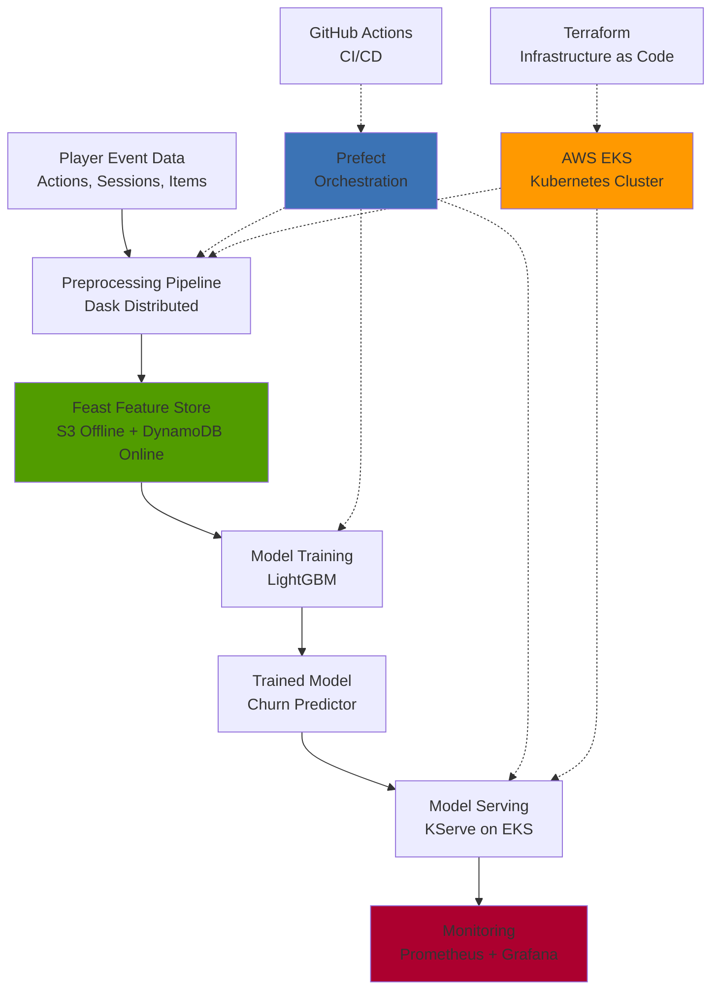

# Player Churn MLOps Pipeline

[](https://github.com/hzabun/player-churn-mlops/actions/workflows/ci.yml)

Production-grade MLOps pipeline for player churn prediction using event-driven behavioral data. Demonstrates end-to-end ML infrastructure with distributed preprocessing (Dask), feature store architecture (Feast), and cloud-native deployment (AWS EKS).

> **Status:** Active development - core infrastructure (Terraform, EKS, Feast, Prefect orchestration) is production-ready. Model serving and monitoring layers in progress.

## System Architecture


## Technical Highlights

**Production ML Infrastructure:**
- AWS EKS cluster provisioned via Terraform for scalable compute
- Containerized preprocessing and training pipelines (Docker + ECR)
- Feast feature store with S3 offline store and DynamoDB online store for low-latency serving
- Prefect orchestration for workflow scheduling and monitoring

**Distributed Data Processing:**
- Event-driven behavioral data (player actions, sessions, items)
- Dask clusters for distributed preprocessing of large game log datasets
- Session aggregation pipeline generating player-level behavioral features

**MLOps Best Practices:**
- Infrastructure as Code (Terraform) for reproducible cloud environments
- CI/CD pipeline (GitHub Actions) with automated linting and testing
- Comprehensive unit tests with >90% coverage
- Model deployment on Kubernetes with KServe (in progress)
- Observability layer with Prometheus and Grafana (in progress)

## At a Glance

| Component           | Technology                              | Status        |
|---------------------|-----------------------------------------|---------------|
| Infrastructure      | Terraform + AWS EKS                     | ✅ Production |
| Data Processing     | Dask (distributed)                      | ✅ Production |
| Feature Store       | Feast (S3 + DynamoDB)                   | ✅ Production |
| Model Training      | LightGBM                                | ✅ Production |
| Orchestration       | Prefect                                 | ✅ Production |
| Containerization    | Docker + AWS ECR                        | ✅ Production |
| CI/CD               | GitHub Actions                          | ✅ Production |
| Model Serving       | KServe on EKS                           | 🚧 In Progress |
| Monitoring          | Prometheus + Grafana                    | 🚧 In Progress |
| Drift Detection     | EvidentlyAI                             | 🚧 Planned    |

## Pipeline Overview
```
Player Events → Dask Preprocessing → Feast Feature Store → LightGBM Training → KServe Deployment → Monitoring
```

**Data Flow:**
1. Raw player event logs (actions, sessions, items) ingested from game servers
2. Distributed preprocessing via Dask clusters aggregates events into session-level features
3. Processed features written to Feast offline store (S3 parquet files)
4. Model training fetches feature sets from Feast for LightGBM training
5. Trained models deployed to AWS EKS via KServe for real-time inference
6. Online features served from DynamoDB for low-latency predictions
7. Monitoring dashboards track model performance and infrastructure health

## Key Features

**Feature Engineering:**
- Session-based behavioral aggregations (actions per session, item transactions, experience gained)
- Temporal features (play frequency, session duration patterns)
- Engagement metrics (progression rate, social interactions)

**Scalability:**
- Kubernetes-based deployment for horizontal scaling
- Distributed preprocessing handles large game log datasets
- Feature store architecture separates offline training from online serving

**Observability:**
- Prefect UI for pipeline monitoring and debugging
- Prometheus metrics collection for infrastructure and model performance
- Grafana dashboards for visualization (in progress)
- EvidentlyAI for data/concept drift detection (planned)

## Quick Start

**Prerequisites:**
- AWS account with EKS access
- Terraform ≥1.0
- Docker
- Python 3.10+

**Setup:**
```bash
# Clone repository
git clone https://github.com/hzabun/player-churn-mlops
cd player-churn-mlops

# Install dependencies
pip install -r requirements.txt

# Provision infrastructure
cd terraform
terraform init
terraform apply

# Run preprocessing pipeline
prefect deployment run preprocessing-flow/production

# Train model
prefect deployment run training-flow/production
```

## Project Structure
```
player-churn-mlops/
├── terraform/              # Infrastructure as Code
│   ├── eks.tf             # EKS cluster configuration
│   ├── networking.tf      # VPC, subnets, security groups
│   └── storage.tf         # S3, DynamoDB setup
├── src/
│   ├── preprocessing/     # Dask-based data pipeline
│   ├── training/          # LightGBM model training
│   ├── serving/           # KServe deployment (in progress)
│   └── monitoring/        # Prometheus + Grafana (in progress)
├── feature_repo/          # Feast feature definitions
├── flows/                 # Prefect orchestration flows
├── tests/                 # Unit tests (>90% coverage)
└── .github/workflows/     # CI/CD pipelines
```

## Roadmap

**Phase 1: Core Infrastructure** ✅
- [x] AWS EKS cluster with Terraform
- [x] Dockerized preprocessing and training
- [x] Feast feature store (S3 + DynamoDB)
- [x] Prefect orchestration
- [x] CI/CD with GitHub Actions
- [x] Comprehensive unit tests

**Phase 2: Production Deployment** 🚧
- [x] EKS-based preprocessing jobs
- [x] EKS-based training jobs
- [ ] KServe model serving on EKS
- [ ] Prometheus + Grafana monitoring
- [ ] EvidentlyAI drift detection

**Phase 3: Automation & Optimization** 📋
- [ ] Automated retraining triggers (GitHub Actions + Prefect)
- [ ] A/B testing framework
- [ ] Cost optimization analysis
- [ ] QuickSight dashboards for business metrics

## Technical Context

Built as a practical exploration of modern MLOps patterns for gaming analytics. Focus areas:

- **Feature store architecture** for decoupling feature engineering from model training
- **Cloud-native deployment** patterns for ML workloads
- **Observability** at infrastructure and model layers
- **Event-driven data processing** for behavioral analytics

## License

MIT License - see LICENSE file for details
